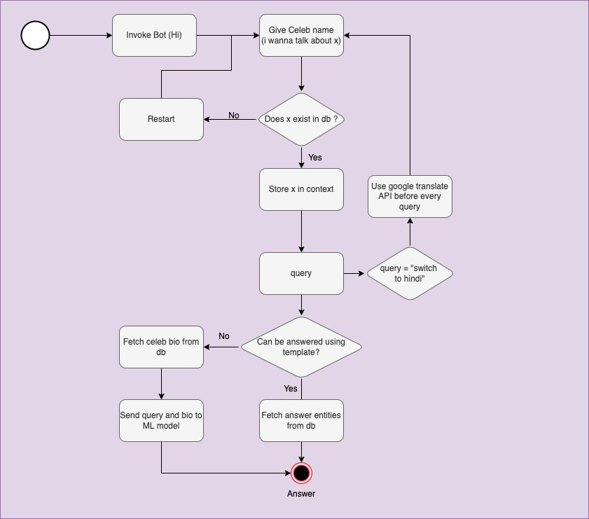

# CELEBRETIES CHATBOT
This chatbot/skill is capable of answering celebrities related questions. This bot is bilingual and can answer both in English and Hindi. Below are some sample
conversations that you can have with the bot.

**English Conversation**
```
type your request: Hi
Hi -> Welcome to Celeb Bot.
    You can ask me about any celebrity and I will try my best to answer you.
    Below are the ways in which you can interact with me:
    I want to talk about Leonardo DiCaprio
    When was he born ?
    When was Angelina Jolie born ?
    What are Brad Pitt's popular films?
    
exec time = 0.006s
type your request: i wanna talk about tom cruise
i wanna talk about tom cruise -> Yes, we can talk about tom cruise
exec time = 0.010s
type your request: where was he born
where was he born ->  Syracuse, New York
exec time = 1.349s
type your request: what did he study
what did he study ->  Franciscan seminary
exec time = 1.269s
type your request: is he popular ?
is he popular ? ->  most sought after
exec time = 1.220s
type your request: how many movies has he done?
how many movies has he done? ->  100
exec time = 1.263s
```
**Hindi Conversation**
```
type your request: switch to hindi
switch to hindi -> अब हम हिंदी में बात कर सकते हैं
exec time = 0.011s
type your request: मैं टॉम क्रूज के बारे में बात करना चाहता हूँ (i wanna talk about tom cruise)
मैं टॉम क्रूज के बारे में बात करना चाहता हूँ -> हाँ, हम टॉम क्रूज के बारे में बात कर सकते हैं
exec time = 2.432s
type your request: वह कब पैदा हुआ था (when was he born)
वह कब पैदा हुआ था -> टॉम क्रूज का जन्म 1962 में हुआ था
exec time = 4.530s
type your request: उसने कहाँ पर पढ़ा था? (where did he study?)
उसने कहाँ पर पढ़ा था? ->  फ्रांसिस्कन मदरसा
exec time = 5.595s
type your request: क्या वह लोकप्रिय है? (is he popular?)
क्या वह लोकप्रिय है? ->  यह संवेदनशील, गहरा धार्मिक नौजवान, जो 1962 में सिरैक्यूज़, न्यूयॉर्क में पैदा हुआ था, उसे सबसे अधिक भुगतान पाने वाले और सबसे अधिक मांग वाले लोगों में से एक बनना तय था
exec time = 4.781s
```

------------
## Design
Below is the flow diagram that explains how queries are answered.


------------
## Setup

## Mongo DB Setup
Basic data of over 11 million celebrities(https://www.imdb.com/interfaces/) on IMDB has been added to mongo db. Mongo Db serves following purposes:
- Check if celeb exists in database.
- Get IMDB id of celeb that can be used to fetch other details about celebs from Db or by directly hitting IMDB website.
- Answer template based queries.
- Answer queries using ML model by pulling celeb bio from mongo Db.

**Setting up Mongo Db**
Following are the steps to setup mongo db to smoothely run this chatbot:

- Install Mongo DB : https://docs.mongodb.com/manual/installation/
- Create a data directory in your mongoDB installation directory and run the following command
```
sudo mkdir -p /data/db
./mongod --dbpath /path-to/mongodb-macos-x86_64-5.0.5/data/db
```

- Following are the commands to load the existing dump in mongo
```
brew tap mongodb/brew
brew install mongodb-database-tools
```

- To dump your database for backup you call this command on your terminal (not required for setup)

```
mongodump --db database_name --collection collection_name
```
- To import your backup file to mongodb you can use the following command on your terminal
```
mongorestore --db database_name path_to_bson_file
```
- Relevant data dump for this project is stored on gcp - https://console.cloud.google.com/storage/browser/dff_celeb?project=pacific-apex-339213 . You'll have to create gcp account to access the cloud storage.
- There are 2 collections **basic_details** and **bio** . Database name is **celeb**. Once you have successfully loaded these collections to mongo db, you are good to go.

## Language Translation Setup

This bot is bilingual. It can answer in both **English** and **Hindi**. This project uses google translate api (https://cloud.google.com/translate/). We are currently providing a service account that can access this service. But this service account will eventually expire. So you'll have to setup your own service account and setup translate api.
To configure translation api, provide 'GCP_KEY' and 'PARENT_PROJECT' parameters in the constants.constants.py file.
- GCP_KEY = {gcp-account-key}
- PARENT_PROJECT = projects/{gcp-project-name}

-----------
## Running the Application
You can use Pycharm to run this application. When you run for the first time it'll take a few minutes to download all the dependencies and ML model. The subsequent runs will be pretty fast. You can start interacting with the chatbot by typing **Hi**
